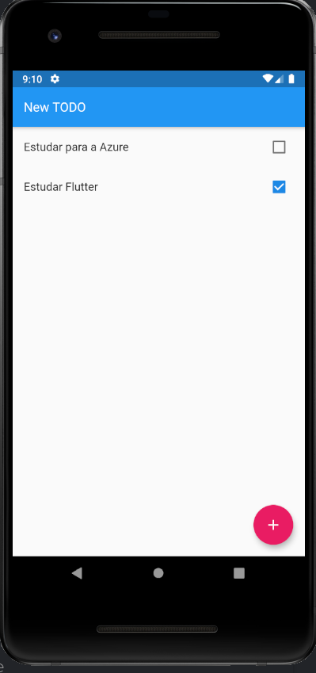

# TODO Application

A new Flutter project.

## Getting Started

This project is a starting point for a Flutter application.

```sh
$ flutter devices -- show devices 
$ flutter pub get -- update library
$ flutter run -- execute project
```

## Application




For help getting started with Flutter, view our
[online documentation](https://flutter.dev/docs), which offers tutorials,
samples, guidance on mobile development, and a full API reference.
